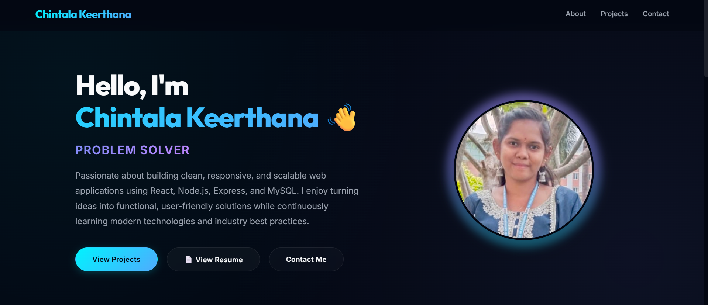

# 🌐 Chintala Keerthana - Personal Portfolio

A modern and responsive personal portfolio website showcasing my skills, projects, education, and contact information as an aspiring Full Stack Developer.

## 🚀 Live Demo

🔗 **Portfolio:** https://my-portfolio-lilac-ten-17.vercel.app/

## 📌 Features

* ✨ Responsive Design
* 🎨 Modern UI
* ⚡ Smooth Animations
* 👩‍💻 About Me Section
* 🛠️ Skills Section
* 📂 Projects Showcase
* 📄 Resume Download
* 📞 Contact Form
* 📱 Mobile Friendly

## 🛠️ Tech Stack

**Frontend**

* React.js
* CSS3
* JavaScript
* HTML5

**Backend**

* Node.js
* Express.js

**Database**

* MySQL

## 📂 Featured Projects

### 🎓 Student Placement Predictor

A machine learning-based web application that predicts student placement chances based on academic performance and skills.

### 📦 Inventra – Intelligent Warehouse Inventory Management System

An inventory management system for efficiently managing products, stock levels, and warehouse operations.

## 📸 Portfolio Preview

## 👩‍💻 Author

**Chintala Keerthana**

* GitHub: https://github.com/Chintala-Keerthana
* Portfolio: https://my-portfolio-lilac-ten-17.vercel.app/

---

⭐ If you like this project, don't forget to give it a Star!
